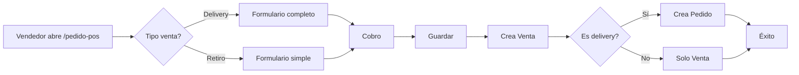

# PLAN DE IMPLEMENTACIÓN: Venta con Pedido desde POS

> **Objetivo:** Crear un nuevo flujo en el punto de venta que permita registrar una venta y opcionalmente crear un pedido de entrega en un solo formulario.
> 
> **Fecha:** Febrero 2026  
> **Estado:** ✅ Backend completado | ⏳ Frontend pendiente  
> **Autor:** Sistema de desarrollo J-Soluciones

---

## 🎯 REFERENCIAS CLAVE

| Documento | Ubicación | Para qué sirve |
|-----------|-----------|----------------|
| **Template React-TS** | `React-TS/` | Componentes UI reutilizables (grids, forms, modals) |
| **Catálogo Template** | `Jsoluciones-docs/contexto/REACT_TS_TEMPLATE_INVENTARIO.md` | Índice completo de 80+ componentes del template |
| **Sistema Amatista (Laravel)** | `Laravel-amatista/` | Referencia de campos y validaciones del formulario de delivery |
| **POS Actual JSoluciones** | `Jsoluciones-fe/src/app/(admin)/(app)/(ventas)/cart/` | Componentes reutilizables del carrito actual |

---

## 📋 ÍNDICE

1. [Resumen Ejecutivo](#resumen-ejecutivo)
2. [Análisis de Requisitos](#análisis-de-requisitos)
3. [Arquitectura de la Solución](#arquitectura-de-la-solución)
4. [Plan de Implementación Backend](#plan-de-implementación-backend) ✅ **COMPLETADO**
5. [Plan de Implementación Frontend](#plan-de-implementación-frontend) ⏳ **PENDIENTE**
6. [Componentes del Template React-TS a Usar](#componentes-del-template-react-ts-a-usar) 🆕
7. [Validaciones y Reglas de Negocio](#validaciones-y-reglas-de-negocio)
8. [Testing y Validación](#testing-y-validación)
9. [Checklist de Implementación](#checklist-de-implementación)

---

## 1. RESUMEN EJECUTIVO

### 1.1 Problema Actual

**Sistema Actual (2 pasos separados):**
```
PASO 1: Crear Venta → /ventas/pos
  - Seleccionar productos
  - Cobrar
  - Guardar venta

PASO 2: Crear Pedido → /distribucion/pedidos/nuevo
  - Seleccionar cliente (de nuevo)
  - Ingresar dirección entrega
  - Asignar transportista
  - Guardar pedido
```

**Problemas:**
- ❌ Flujo largo (45-60 segundos)
- ❌ Navegación entre pantallas
- ❌ Duplicación de datos (cliente se ingresa 2 veces)
- ❌ Riesgo de olvidar crear el pedido después de la venta
- ❌ Confusión para el vendedor

### 1.2 Solución Propuesta

**Nuevo Flujo (TODO EN UNO):**
```
UNA PANTALLA: /ventas/pedido-pos
  1. Selector: ¿Delivery o Retiro en tienda?
  2. Seleccionar cliente
  3. Agregar productos al carrito
  4. SI es delivery → Ingresar datos de entrega
  5. Procesar cobro
  6. Guardar → Crea Venta + Pedido automático
```

**Beneficios:**
- ✅ Flujo rápido (20-30 segundos)
- ✅ Una sola pantalla
- ✅ Datos unificados
- ✅ Menos errores
- ✅ Cliente más satisfecho

### 1.3 Alcance

**EN ALCANCE:**
- ✅ Nueva página `/ventas/pedido-pos` en frontend
- ✅ Nuevo endpoint `POST /api/v1/ventas/pedido-pos/` en backend
- ✅ Selector tipo de venta (delivery/retiro)
- ✅ Campos condicionales de entrega
- ✅ Creación automática de Venta + Pedido en una transacción

**FUERA DE ALCANCE:**
- ❌ Modificar POS actual `/ventas/pos` (se mantiene intacto)
- ❌ Modificar módulo de distribución (solo se usa)
- ❌ Cambios en base de datos (los modelos ya existen)

---

## 2. ANÁLISIS DE REQUISITOS

### 2.1 Campos Necesarios (Comparación con Amatista)

| Sección | Campo | Amatista | J-Soluciones Backend | Obligatorio | Notas |
|---------|-------|----------|---------------------|-------------|-------|
| **Tipo** | Tipo entrega | ❌ | ✅ Nuevo campo UI | Sí | Radio: delivery/retiro |
| **Cliente** | Cliente | ✅ `nombre_cliente` | ✅ `cliente_id` (FK) | Sí | Selector de clientes existentes |
| | Teléfono cliente | ✅ `telefono_cliente` | ✅ En modelo Cliente | No | Ya está en Cliente |
| **Productos** | Lista productos | ✅ `productos_json` | ✅ `items[]` | Sí | Carrito con qty, precio |
| | Subtotal | ✅ Auto-calculado | ✅ `total_gravada` | Sí | Suma de items |
| | IGV | ✅ Auto-calculado | ✅ `total_igv` | Sí | 18% |
| | Total | ✅ Auto-calculado | ✅ `total_venta` | Sí | Subtotal + IGV + Delivery |
| **Pago** | Método pago | ✅ `metodo_pago` | ✅ `metodo_pago` | Sí | Yape, Efectivo, etc. |
| | Costo delivery | ✅ `costo_delivery` | ✅ `costo_delivery` | No | Default: 0 |
| **Destinatario** | Nombre destinatario | ✅ `nombre_destinatario` | ✅ `nombre_destinatario` | Solo delivery | Quien recibe |
| | Teléfono destinatario | ✅ `telefono_destinatario` | ✅ `telefono_destinatario` | Solo delivery | Contacto entrega |
| | Dirección | ✅ `direccion_destinatario` | ✅ `direccion_entrega` | Solo delivery | Dirección completa |
| | Distrito | ✅ `distrito` (enum) | ❌ En dirección | Solo delivery | Parte de dirección |
| | Enlace Maps | ✅ `enlace_ubicacion` | ✅ `enlace_ubicacion` | No | Google Maps URL |
| | Turno | ✅ `turno_entrega` | ✅ `turno_entrega` | Solo delivery | Mañana/Tarde |
| **Entrega** | Fecha entrega | ✅ `fecha_entrega` | ✅ `fecha_estimada_entrega` | Solo delivery | Date picker |
| | Es urgente | ✅ `es_urgente` | ✅ `es_urgente` | No | Checkbox |
| | Transportista | ✅ `conductor_id` | ✅ `transportista_id` | No | Opcional asignar |
| | Dedicatoria | ✅ `dedicatoria` | ✅ `dedicatoria` | No | Mensaje opcional |
| | Observación | ✅ `observacion` | ✅ `notas` | No | Notas internas |

### 2.2 Estados y Flujos

**Flujo de Estados:**



---

## 3. ARQUITECTURA DE LA SOLUCIÓN

### 3.1 Estructura de Archivos

**BACKEND (apps/ventas/):**
```
apps/ventas/
├── models.py              # ⚠️ NO MODIFICAR (campos ya existen)
├── serializers.py         # ✅ AGREGAR: VentaConPedidoPOSSerializer
├── services.py            # ✅ AGREGAR: crear_venta_con_pedido_pos()
├── views.py               # ✅ AGREGAR: VentaConPedidoPOSView
└── urls.py                # ✅ AGREGAR: ruta "pedido-pos/"
```

**FRONTEND (src/app/(admin)/(app)/):**
```
src/app/(admin)/(app)/(ventas)/
├── cart/                      # ⚠️ NO MODIFICAR (POS actual)
│   ├── index.tsx
│   └── components/
│       ├── CobroModal.tsx
│       ├── CartItemList.tsx
│       ├── CartSummary.tsx
│       ├── ClienteSelector.tsx
│       └── ProductGrid.tsx
│
└── pedido-pos/                # ✅ CREAR NUEVO (Nueva página)
    ├── index.tsx              # ✅ Página principal
    ├── types.ts               # ✅ Tipos locales
    └── components/
        ├── TipoPedidoSelector.tsx     # ✅ Radio delivery/retiro
        ├── DatosEntregaForm.tsx       # ✅ Campos condicionales entrega
        ├── ClienteSelector.tsx        # ♻️ Reutilizar de cart/
        ├── ProductGrid.tsx            # ♻️ Reutilizar de cart/
        ├── CartItemList.tsx           # ♻️ Reutilizar de cart/
        ├── CartSummary.tsx            # ♻️ Modificar (agregar delivery)
        └── CobroModal.tsx             # ♻️ Reutilizar de cart/
```

**RUTAS:**
```typescript
// src/routes/Routes.tsx
{ 
  path: '/ventas/pedido-pos', 
  name: 'Venta con Pedido', 
  element: <PedidoPOS />, 
  requiredPermission: 'ventas.crear' 
}
```

### 3.2 Flujo de Datos

```
┌─────────────────────────────────────────────────────────────┐
│                    FRONTEND (React)                         │
├─────────────────────────────────────────────────────────────┤
│                                                             │
│  1. Usuario selecciona tipo: Delivery/Retiro               │
│  2. Agrega productos al carrito                             │
│  3. Ingresa datos (condicionales si es delivery)            │
│  4. Click "Procesar Cobro"                                  │
│  5. Confirma pago en CobroModal                             │
│  6. POST /api/v1/ventas/pedido-pos/                         │
│                                                             │
│  Payload:                                                   │
│  {                                                          │
│    es_delivery: true,                                       │
│    cliente_id: "uuid",                                      │
│    items: [{producto_id, cantidad, precio}, ...],           │
│    caja: "CAJA-01",                                         │
│    almacen_id: "uuid",                                      │
│    metodo_pago: "efectivo",                                 │
│    // Campos delivery (solo si es_delivery=true):          │
│    direccion_entrega: "Av. Larco 123",                      │
│    fecha_entrega: "2026-02-25",                             │
│    turno_entrega: "manana",                                 │
│    costo_delivery: 15.00,                                   │
│    transportista_id: "uuid" (opcional),                     │
│    dedicatoria: "Feliz cumpleaños",                         │
│    nombre_destinatario: "María García",                     │
│    telefono_destinatario: "999888777",                      │
│    es_urgente: false                                        │
│  }                                                          │
└─────────────────────────────────────────────────────────────┘
                            │
                            ▼
┌─────────────────────────────────────────────────────────────┐
│                  BACKEND (Django REST)                      │
├─────────────────────────────────────────────────────────────┤
│                                                             │
│  VentaConPedidoPOSView.post()                               │
│    │                                                        │
│    ├─▶ VentaConPedidoPOSSerializer.is_valid()              │
│    │   ├─ Valida campos obligatorios                       │
│    │   └─ Valida delivery fields solo si es_delivery=true  │
│    │                                                        │
│    └─▶ crear_venta_con_pedido_pos()                        │
│        │                                                    │
│        ├─▶ @transaction.atomic                             │
│        │   │                                                │
│        │   ├─▶ crear_venta_pos() [EXISTENTE]               │
│        │   │   ├─ Valida cliente, stock, caja abierta      │
│        │   │   ├─ Descuenta stock con locks                │
│        │   │   ├─ Crea Venta + DetalleVenta                │
│        │   │   ├─ Registra movimientos inventario          │
│        │   │   └─ Encola comprobante SUNAT                 │
│        │   │                                                │
│        │   └─▶ if es_delivery:                             │
│        │       crear_pedido() [EXISTENTE distribucion/]    │
│        │       ├─ Genera numero pedido (PED-00001)         │
│        │       ├─ Genera codigo_seguimiento (8 chars)      │
│        │       ├─ Crea Pedido vinculado a Venta            │
│        │       │   - venta_id = venta.id                   │
│        │       │   - cliente_id = venta.cliente_id         │
│        │       │   - direccion_entrega, turno, etc         │
│        │       │   - estado = "pendiente"                  │
│        │       └─ Crea SeguimientoPedido inicial           │
│        │                                                    │
│        └─▶ return {venta_id, pedido_id}                    │
│                                                             │
└─────────────────────────────────────────────────────────────┘
                            │
                            ▼
┌─────────────────────────────────────────────────────────────┐
│                    BASE DE DATOS                            │
├─────────────────────────────────────────────────────────────┤
│                                                             │
│  ✅ ventas (1 registro)                                     │
│     - id, numero, cliente_id, total_venta, etc.             │
│                                                             │
│  ✅ detalle_ventas (N registros)                            │
│     - venta_id, producto_id, cantidad, precio, etc.         │
│                                                             │
│  ✅ movimientos_stock (N registros)                         │
│     - tipo=salida, producto_id, cantidad, etc.              │
│                                                             │
│  ✅ pedidos (1 registro, solo si es_delivery=true)          │
│     - id, numero, venta_id ← VÍNCULO                        │
│     - cliente_id, direccion_entrega, etc.                   │
│     - estado=pendiente                                      │
│                                                             │
│  ✅ seguimiento_pedidos (1 registro inicial)                │
│     - pedido_id, estado=pendiente, fecha                    │
│                                                             │
└─────────────────────────────────────────────────────────────┘
```

---

## 3A. COMPONENTES DEL TEMPLATE REACT-TS A USAR

> **📚 Referencia principal:** `Jsoluciones-docs/contexto/REACT_TS_TEMPLATE_INVENTARIO.md`

Esta sección detalla qué componentes del template React-TS reutilizaremos para construir la nueva página `/ventas/pedido-pos`.

### 3A.1 Componentes Base del Template

| Componente Template | Ubicación en React-TS | Cómo lo usaremos | Personalizaciones |
|---------------------|----------------------|------------------|-------------------|
| **Product Grid** | `(ecommerce)/product-grid/` | Base para catálogo de productos | ✅ Ya existe en JSoluciones (`cart/ProductGrid.tsx`) |
| **Shopping Cart** | `(ecommerce)/cart/` | Inspiración para CartItemList | ✅ Ya existe (`cart/CartItemList.tsx`) |
| **Cart Summary** | `(ecommerce)/cart/components/OrderSummary.tsx` | Resumen de totales | ✅ Modificar para agregar línea "Costo Delivery" |
| **Checkout Form** | `(ecommerce)/checkout/components/ShoppingInformation.tsx` | Inspiración para formulario de entrega | ⚠️ Adaptar campos a modelo Pedido |
| **Date Picker** | Usa **Flatpickr** (librería del template) | Selector fecha de entrega | ✅ Usar Flatpickr directo |
| **Radio Buttons** | Tailwind CSS classes estándar | Selector Delivery/Retiro | ✅ Custom simple con Tailwind |

### 3A.2 Componentes Reutilizables del POS Actual

| Componente JSoluciones | Ubicación | Descripción | ¿Reutilizar? |
|------------------------|-----------|-------------|--------------|
| `ClienteSelector.tsx` | `cart/components/` | Selector de cliente con búsqueda | ✅ **Copiar tal cual** |
| `ProductGrid.tsx` | `cart/components/` | Grid de productos con filtros | ✅ **Copiar tal cual** |
| `CartItemList.tsx` | `cart/components/` | Lista de items del carrito | ✅ **Copiar tal cual** |
| `CartSummary.tsx` | `cart/components/` | Resumen de totales (Subtotal, IGV, Total) | ⚠️ **Modificar**: agregar línea "Costo Delivery" |
| `CobroModal.tsx` | `cart/components/` | Modal de cobro con métodos de pago | ✅ **Copiar tal cual** |

### 3A.3 Componentes Nuevos a Crear

#### **1. TipoPedidoSelector.tsx**

Selector de tipo de venta con radio buttons.

**Diseño visual (referencia Tailwind):**
```tsx
// Inspirado en: React-TS/src/app/(auth)/modern-login/ (tabs email/phone)
// Pero usando radio buttons en vez de tabs

<div className="grid grid-cols-2 gap-4 mb-6">
  <label className={`
    flex items-center justify-center p-4 border-2 rounded-lg cursor-pointer
    transition-all duration-200
    ${esDelivery 
      ? 'border-custom-500 bg-custom-50 ring-2 ring-custom-200' 
      : 'border-slate-200 hover:border-custom-300'
    }
  `}>
    <input 
      type="radio" 
      name="tipoPedido" 
      value="delivery"
      checked={esDelivery}
      className="sr-only"
    />
    <LuTruck className="size-5 mr-2" />
    <span className="font-medium">Delivery</span>
  </label>

  <label className={`
    flex items-center justify-center p-4 border-2 rounded-lg cursor-pointer
    ${!esDelivery 
      ? 'border-custom-500 bg-custom-50 ring-2 ring-custom-200' 
      : 'border-slate-200 hover:border-custom-300'
    }
  `}>
    <input 
      type="radio" 
      name="tipoPedido" 
      value="retiro"
      checked={!esDelivery}
      className="sr-only"
    />
    <LuStore className="size-5 mr-2" />
    <span className="font-medium">Retiro en Tienda</span>
  </label>
</div>
```

**Props:**
```typescript
interface TipoPedidoSelectorProps {
  esDelivery: boolean;
  onChange: (esDelivery: boolean) => void;
}
```

---

#### **2. DatosEntregaForm.tsx**

Formulario completo de datos de entrega (solo se muestra si `esDelivery === true`).

**Campos (basados en modelo Pedido + referencia Amatista):**

| Campo UI | Campo Backend | Tipo Input | Validación | Referencia Template |
|----------|---------------|------------|------------|---------------------|
| Nombre destinatario | `nombre_destinatario` | `<input type="text">` | Required, max 200 | Checkout: billing name |
| Teléfono destinatario | `telefono_destinatario` | `<input type="tel">` | Required, max 20 | Checkout: phone |
| Dirección de entrega | `direccion_entrega` | `<textarea>` | Required, max 500 | Checkout: address |
| Enlace Google Maps | `enlace_ubicacion` | `<input type="url">` | Optional | Custom |
| Fecha de entrega | `fecha_entrega` | **Flatpickr** | Required, >= hoy | Template usa Flatpickr |
| Turno de entrega | `turno_entrega` | `<select>` | Required | Custom (Mañana/Tarde) |
| Costo delivery (S/) | `costo_delivery` | `<input type="number">` | Default 0, min 0 | Custom |
| Transportista | `transportista_id` | `<select>` (async) | Optional | Cargar desde API |
| Dedicatoria | `dedicatoria` | `<textarea>` | Optional, max 1000 | Custom |
| ¿Es urgente? | `es_urgente` | `<input type="checkbox">` | Boolean | Custom checkbox |
| Observaciones | `notas` | `<textarea>` | Optional, max 500 | Custom |

**Referencia de diseño visual:**
- Base: `React-TS/src/app/(admin)/(app)/(ecommerce)/checkout/components/ShoppingInformation.tsx`
- Distribución: Grid 2 columnas en desktop, 1 en mobile
- Flatpickr date picker: Ya configurado en template (ver `package.json`)

**Código esqueleto:**
```tsx
import Flatpickr from 'react-flatpickr';
import 'flatpickr/dist/flatpickr.min.css';

export default function DatosEntregaForm({ 
  datos, 
  onChange, 
  errores 
}: DatosEntregaFormProps) {
  return (
    <div className="space-y-6 p-6 bg-white dark:bg-zink-700 border border-slate-200 dark:border-zink-500 rounded-md">
      <h5 className="mb-4 text-16">📦 Datos de Entrega</h5>

      {/* Grid 2 columnas */}
      <div className="grid grid-cols-1 gap-5 lg:grid-cols-2">
        
        {/* Nombre destinatario */}
        <div>
          <label className="inline-block mb-2 text-base font-medium">
            Nombre destinatario <span className="text-red-500">*</span>
          </label>
          <input 
            type="text"
            className="form-input"
            value={datos.nombre_destinatario}
            onChange={(e) => onChange('nombre_destinatario', e.target.value)}
          />
          {errores.nombre_destinatario && (
            <p className="mt-1 text-sm text-red-500">{errores.nombre_destinatario}</p>
          )}
        </div>

        {/* Teléfono destinatario */}
        <div>
          <label className="inline-block mb-2 text-base font-medium">
            Teléfono destinatario <span className="text-red-500">*</span>
          </label>
          <input 
            type="tel"
            className="form-input"
            value={datos.telefono_destinatario}
            onChange={(e) => onChange('telefono_destinatario', e.target.value)}
          />
          {errores.telefono_destinatario && (
            <p className="mt-1 text-sm text-red-500">{errores.telefono_destinatario}</p>
          )}
        </div>

        {/* Dirección (full width) */}
        <div className="lg:col-span-2">
          <label className="inline-block mb-2 text-base font-medium">
            Dirección de entrega <span className="text-red-500">*</span>
          </label>
          <textarea 
            className="form-input"
            rows={3}
            value={datos.direccion_entrega}
            onChange={(e) => onChange('direccion_entrega', e.target.value)}
          />
        </div>

        {/* Fecha entrega (Flatpickr) */}
        <div>
          <label className="inline-block mb-2 text-base font-medium">
            Fecha de entrega <span className="text-red-500">*</span>
          </label>
          <Flatpickr
            className="form-input"
            options={{
              dateFormat: 'Y-m-d',
              minDate: 'today',
              locale: 'es'
            }}
            value={datos.fecha_entrega}
            onChange={([date]) => onChange('fecha_entrega', date)}
          />
        </div>

        {/* Turno */}
        <div>
          <label className="inline-block mb-2 text-base font-medium">
            Turno de entrega <span className="text-red-500">*</span>
          </label>
          <select 
            className="form-input"
            value={datos.turno_entrega}
            onChange={(e) => onChange('turno_entrega', e.target.value)}
          >
            <option value="">Seleccionar...</option>
            <option value="manana">Mañana (8am - 1pm)</option>
            <option value="tarde">Tarde (2pm - 7pm)</option>
          </select>
        </div>

        {/* Costo delivery */}
        <div>
          <label className="inline-block mb-2 text-base font-medium">
            Costo delivery (S/)
          </label>
          <input 
            type="number"
            step="0.01"
            min="0"
            className="form-input"
            value={datos.costo_delivery}
            onChange={(e) => onChange('costo_delivery', parseFloat(e.target.value) || 0)}
          />
        </div>

        {/* Transportista (opcional) */}
        <div>
          <label className="inline-block mb-2 text-base font-medium">
            Transportista (opcional)
          </label>
          <select 
            className="form-input"
            value={datos.transportista_id || ''}
            onChange={(e) => onChange('transportista_id', e.target.value || null)}
          >
            <option value="">Sin asignar</option>
            {/* Cargar desde useGetTransportistas() */}
          </select>
        </div>

        {/* Dedicatoria (full width) */}
        <div className="lg:col-span-2">
          <label className="inline-block mb-2 text-base font-medium">
            Dedicatoria (opcional)
          </label>
          <textarea 
            className="form-input"
            rows={2}
            placeholder="Ej: Feliz cumpleaños..."
            value={datos.dedicatoria}
            onChange={(e) => onChange('dedicatoria', e.target.value)}
          />
        </div>

        {/* Es urgente checkbox */}
        <div className="flex items-center gap-2">
          <input 
            type="checkbox"
            id="es_urgente"
            className="size-4 border rounded-sm appearance-none bg-slate-100 border-slate-200 dark:bg-zink-600 dark:border-zink-500 checked:bg-custom-500 checked:border-custom-500"
            checked={datos.es_urgente}
            onChange={(e) => onChange('es_urgente', e.target.checked)}
          />
          <label htmlFor="es_urgente" className="text-base cursor-pointer">
            ⚡ Entrega urgente
          </label>
        </div>

      </div>
    </div>
  );
}
```

---

### 3A.4 Layout de la Página Principal

**Diseño propuesto (inspirado en POS actual + Checkout template):**

```
┌────────────────────────────────────────────────────────────────┐
│  VENTA CON PEDIDO - POS                                        │
├────────────────────────────────────────────────────────────────┤
│                                                                │
│  [Breadcrumb: Ventas > Venta con Pedido]                       │
│                                                                │
│  ┌──────────────────────────────────────────────────────────┐ │
│  │  TIPO DE VENTA (Radio Buttons)                           │ │
│  │  ○ Delivery   ● Retiro en Tienda                         │ │
│  └──────────────────────────────────────────────────────────┘ │
│                                                                │
│  ┌──────────────────────────────────────────────────────────┐ │
│  │  CLIENTE (Selector con búsqueda)                         │ │
│  │  [ClienteSelector component] ← REUTILIZAR                │ │
│  └──────────────────────────────────────────────────────────┘ │
│                                                                │
│  ┌─────────────────────────────┬──────────────────────────────┐
│  │  PRODUCTOS (Grid)           │  CARRITO (Resumen)          │
│  │                             │                              │
│  │  [ProductGrid]              │  [CartItemList]              │
│  │  ← REUTILIZAR               │  ← REUTILIZAR                │
│  │                             │                              │
│  │  [Búsqueda + Filtros]       │  Subtotal:  S/ 100.00        │
│  │  [Grid de productos]        │  IGV (18%): S/  18.00        │
│  │                             │  🚚 Delivery: S/  15.00       │
│  │                             │  ────────────────────────    │
│  │                             │  TOTAL:     S/ 133.00        │
│  │                             │                              │
│  │                             │  [Procesar Cobro] ← Modal    │
│  └─────────────────────────────┴──────────────────────────────┘
│                                                                │
│  ┌──────────────────────────────────────────────────────────┐ │
│  │  DATOS DE ENTREGA (Solo si es Delivery)                  │ │
│  │  [DatosEntregaForm component] ← NUEVO                    │ │
│  │  - Nombre destinatario                                    │ │
│  │  - Teléfono, Dirección, Fecha, Turno                     │ │
│  │  - Costo delivery, Transportista, Dedicatoria            │ │
│  └──────────────────────────────────────────────────────────┘ │
│                                                                │
└────────────────────────────────────────────────────────────────┘
```

---

### 3A.5 Clases CSS del Template (Tailwind)

**Clases importantes del template a usar:**

| Elemento | Clases Tailwind (del template) |
|----------|-------------------------------|
| **Card principal** | `card` (custom class del template) |
| **Input text** | `form-input` (custom class) |
| **Select** | `form-input` (reutiliza input styles) |
| **Textarea** | `form-input` |
| **Button primary** | `text-white btn bg-custom-500 border-custom-500 hover:bg-custom-600` |
| **Button secondary** | `text-slate-500 btn bg-white border-slate-200` |
| **Badge success** | `px-2.5 py-0.5 text-xs font-medium rounded border bg-green-100 border-green-200 text-green-500` |
| **Badge danger** | `px-2.5 py-0.5 text-xs font-medium rounded border bg-red-100 border-red-200 text-red-500` |
| **Grid 2 cols** | `grid grid-cols-1 gap-5 lg:grid-cols-2` |
| **Checkbox styled** | `size-4 border rounded-sm appearance-none bg-slate-100 border-slate-200 checked:bg-custom-500` |

**Colores custom del template:**
```css
/* Ya definidos en Tailwind config de JSoluciones-fe */
--color-custom-50:  #eff6ff;   /* Fondo claro */
--color-custom-500: #6366f1;   /* Primary */
--color-custom-600: #4f46e5;   /* Primary hover */
```

---

### 3A.6 Comparación con Amatista (Laravel)

Para mantener consistencia con el sistema existente, estos son los campos equivalentes:

| Campo Amatista | Campo JSoluciones | Componente UI |
|----------------|-------------------|---------------|
| `nombre_cliente` | En modelo `Cliente` | `ClienteSelector` |
| `telefono_cliente` | En modelo `Cliente` | `ClienteSelector` (readonly) |
| `productos_json` | `items[]` array | `CartItemList` |
| `direccion_destinatario` | `direccion_entrega` | `<textarea>` en `DatosEntregaForm` |
| `distrito` | Parte de `direccion_entrega` | Incluido en dirección |
| `turno_entrega` | `turno_entrega` | `<select>` Mañana/Tarde |
| `fecha_entrega` | `fecha_entrega` | **Flatpickr** date picker |
| `costo_delivery` | `costo_delivery` | `<input type="number">` |
| `metodo_pago` | `metodo_pago` | `CobroModal` (ya existe) |
| `dedicatoria` | `dedicatoria` | `<textarea>` |
| `observacion` | `notas` | `<textarea>` |
| `conductor_id` | `transportista_id` | `<select>` async |
| `enlace_ubicacion` | `enlace_ubicacion` | `<input type="url">` |
| `es_urgente` | `es_urgente` | `<input type="checkbox">` |

---

## 4. PLAN DE IMPLEMENTACIÓN BACKEND

### 4.1 Archivo: `apps/ventas/serializers.py`

**Ubicación:** Agregar al final del archivo (después de línea 495)

```python
# ============================================================================
# VENTA CON PEDIDO POS (Nuevo flujo unificado)
# ============================================================================

class VentaConPedidoPOSSerializer(serializers.Serializer):
    """
    Serializer para crear venta + pedido en un solo request.
    
    Campos obligatorios siempre:
    - cliente_id, items, caja, almacen_id, metodo_pago
    
    Campos obligatorios solo si es_delivery=True:
    - direccion_entrega, fecha_entrega, turno_entrega
    """
    
    # ===== CAMPOS COMUNES (Venta) =====
    cliente_id = serializers.UUIDField()
    items = ItemPOSSerializer(many=True)
    caja = serializers.CharField(max_length=50)
    almacen_id = serializers.UUIDField()
    metodo_pago = serializers.CharField(max_length=20)
    
    # ===== SWITCH: ¿Es delivery? =====
    es_delivery = serializers.BooleanField(default=False)
    
    # ===== CAMPOS DELIVERY (Opcionales si es_delivery=False) =====
    direccion_entrega = serializers.CharField(
        max_length=500, 
        required=False, 
        allow_blank=True
    )
    fecha_entrega = serializers.DateField(required=False, allow_null=True)
    turno_entrega = serializers.ChoiceField(
        choices=[('manana', 'Mañana (AM)'), ('tarde', 'Tarde (PM)')],
        required=False,
        allow_blank=True
    )
    costo_delivery = serializers.DecimalField(
        max_digits=10, 
        decimal_places=2, 
        default=0,
        required=False
    )
    transportista_id = serializers.UUIDField(
        required=False, 
        allow_null=True
    )
    
    # ===== CAMPOS DESTINATARIO =====
    nombre_destinatario = serializers.CharField(
        max_length=200, 
        required=False, 
        allow_blank=True
    )
    telefono_destinatario = serializers.CharField(
        max_length=20, 
        required=False, 
        allow_blank=True
    )
    
    # ===== CAMPOS OPCIONALES =====
    dedicatoria = serializers.CharField(
        max_length=1000, 
        required=False, 
        allow_blank=True
    )
    enlace_ubicacion = serializers.URLField(
        max_length=500, 
        required=False, 
        allow_blank=True
    )
    es_urgente = serializers.BooleanField(default=False, required=False)
    notas = serializers.CharField(
        max_length=500, 
        required=False, 
        allow_blank=True
    )
    
    def validate(self, attrs):
        """Validación custom: campos delivery obligatorios si es_delivery=True"""
        es_delivery = attrs.get('es_delivery', False)
        
        if es_delivery:
            # Campos OBLIGATORIOS para delivery
            required_fields = [
                'direccion_entrega',
                'fecha_entrega',
                'turno_entrega',
                'nombre_destinatario',
                'telefono_destinatario',
            ]
            
            for field in required_fields:
                value = attrs.get(field)
                if not value:
                    raise serializers.ValidationError({
                        field: f"Este campo es obligatorio cuando es_delivery=true"
                    })
        
        return attrs
```

**Líneas agregadas:** ~80 líneas  
**Punto de inserción:** Después de `FormaPagoCreateSerializer` (línea 495)

---

### 4.2 Archivo: `apps/ventas/services.py`

**Ubicación:** Agregar al final del archivo (después de línea 850)

```python
# ============================================================================
# VENTA CON PEDIDO POS (Nuevo flujo unificado)
# ============================================================================

@transaction.atomic
def crear_venta_con_pedido_pos(datos: dict, usuario) -> dict:
    """
    Crea una venta POS y opcionalmente un pedido de entrega.
    
    Flujo:
    1. Crea la venta (reutiliza crear_venta_pos existente)
    2. Si es_delivery=True, crea el pedido vinculado a la venta
    
    Args:
        datos (dict): Datos validados del serializer
        usuario: Usuario autenticado
    
    Returns:
        dict: {'venta': Venta, 'pedido': Pedido | None}
    
    Raises:
        ValidationError: Si falla alguna validación
    """
    from apps.distribucion.services import crear_pedido
    
    # ===== 1. CREAR VENTA (Reutilizar lógica existente) =====
    # Preparar datos para crear_venta_pos (campos que necesita)
    datos_venta = {
        'cliente_id': datos['cliente_id'],
        'items': datos['items'],
        'caja': datos['caja'],
        'almacen_id': datos['almacen_id'],
        'metodo_pago': datos.get('metodo_pago', 'efectivo'),
    }
    
    # Crear venta (ya valida stock, caja, límite crédito, etc.)
    venta = crear_venta_pos(datos_venta, usuario)
    
    # ===== 2. SI ES DELIVERY, CREAR PEDIDO =====
    pedido = None
    
    if datos.get('es_delivery', False):
        # Preparar datos para crear_pedido
        datos_pedido = {
            'cliente_id': str(datos['cliente_id']),
            'venta_id': str(venta.id),  # ← VÍNCULO CRÍTICO
            'direccion_entrega': datos['direccion_entrega'],
            'fecha_estimada_entrega': datos['fecha_entrega'],
            'turno_entrega': datos.get('turno_entrega', 'manana'),
            'costo_delivery': datos.get('costo_delivery', 0),
            'nombre_destinatario': datos.get('nombre_destinatario', ''),
            'telefono_destinatario': datos.get('telefono_destinatario', ''),
            'dedicatoria': datos.get('dedicatoria', ''),
            'enlace_ubicacion': datos.get('enlace_ubicacion', ''),
            'es_urgente': datos.get('es_urgente', False),
            'notas': datos.get('notas', ''),
            'transportista_id': datos.get('transportista_id'),
        }
        
        # Crear pedido (genera número, código seguimiento, etc.)
        pedido = crear_pedido(datos_pedido, usuario)
        
        # Log para auditoría
        logger.info(
            f"Venta {venta.numero} con pedido {pedido.numero} creada "
            f"por {usuario.email}"
        )
    else:
        # Solo venta, sin pedido
        logger.info(
            f"Venta {venta.numero} (retiro en tienda) creada por {usuario.email}"
        )
    
    return {
        'venta': venta,
        'pedido': pedido,
    }
```

**Líneas agregadas:** ~75 líneas  
**Punto de inserción:** Al final del archivo (después de última función)  
**Dependencias:** Importar `crear_pedido` de `apps.distribucion.services`

---

### 4.3 Archivo: `apps/ventas/views.py`

**Ubicación:** Agregar al final de las views (después de línea 450)

```python
# ============================================================================
# VENTA CON PEDIDO POS (Nuevo flujo unificado)
# ============================================================================

class VentaConPedidoPOSView(APIView):
    """
    Vista para crear venta + pedido en un solo endpoint.
    
    POST /api/v1/ventas/pedido-pos/
    
    Request body: VentaConPedidoPOSSerializer
    
    Response:
    {
        "venta_id": "uuid",
        "venta_numero": "V-00123",
        "pedido_id": "uuid" | null,
        "pedido_numero": "PED-00045" | null,
        "codigo_seguimiento": "AB12CD34" | null
    }
    """
    
    permission_classes = [IsAuthenticated]
    
    def post(self, request):
        # Validar datos
        serializer = VentaConPedidoPOSSerializer(data=request.data)
        serializer.is_valid(raise_exception=True)
        
        try:
            # Crear venta + pedido
            resultado = crear_venta_con_pedido_pos(
                serializer.validated_data,
                request.user
            )
            
            venta = resultado['venta']
            pedido = resultado['pedido']
            
            # Construir respuesta
            response_data = {
                'venta_id': str(venta.id),
                'venta_numero': venta.numero,
                'pedido_id': str(pedido.id) if pedido else None,
                'pedido_numero': pedido.numero if pedido else None,
                'codigo_seguimiento': pedido.codigo_seguimiento if pedido else None,
            }
            
            return Response(response_data, status=status.HTTP_201_CREATED)
            
        except ValidationError as e:
            return Response(
                {'error': str(e)},
                status=status.HTTP_400_BAD_REQUEST
            )
        except Exception as e:
            logger.error(f"Error creando venta con pedido: {e}", exc_info=True)
            return Response(
                {'error': 'Error interno del servidor'},
                status=status.HTTP_500_INTERNAL_SERVER_ERROR
            )
```

**Líneas agregadas:** ~50 líneas  
**Punto de inserción:** Después de `FormaPagoViewSet` (línea 450)  
**Imports necesarios:**
```python
from rest_framework.views import APIView
from rest_framework.response import Response
from rest_framework import status
from .serializers import VentaConPedidoPOSSerializer
from .services import crear_venta_con_pedido_pos
```

---

### 4.4 Archivo: `apps/ventas/urls.py`

**Ubicación:** Agregar en la sección de paths (línea 26)

```python
# Venta con Pedido POS (nuevo flujo unificado)
path("pedido-pos/", VentaConPedidoPOSView.as_view(), name="venta-pedido-pos"),
```

**Líneas agregadas:** 1 línea  
**Punto de inserción:** Después de `path("pos/", ...)` (línea 26)  
**Import necesario:**
```python
from .views import VentaConPedidoPOSView
```

---

### 4.5 Validaciones Backend

**YA EXISTEN en `crear_venta_pos()` (se reutilizan):**
- ✅ Validar caja abierta (línea 379-398)
- ✅ Validar stock disponible con locks (línea 422-434)
- ✅ Validar límite de crédito cliente (línea 471-487)
- ✅ Validar que cliente existe
- ✅ Descuento atómico de stock

**NUEVAS validaciones en `VentaConPedidoPOSSerializer`:**
- ✅ Campos delivery obligatorios solo si `es_delivery=True`
- ✅ Fecha entrega no puede ser pasada
- ✅ URL de ubicación válida (si se proporciona)

**VALIDACIONES en `crear_pedido()` (distribucion, ya existen):**
- ✅ Cliente existe
- ✅ Transportista existe (si se proporciona)
- ✅ Genera número correlativo único
- ✅ Genera código seguimiento único (8 caracteres)

---

## 5. PLAN DE IMPLEMENTACIÓN FRONTEND

### 5.1 Referencia de Componentes del Template

**Componentes a reutilizar de React-TS:**

| Componente | Ruta en React-TS | Uso en pedido-pos | Modificaciones |
|------------|------------------|-------------------|----------------|
| **Product Grid** | `(ecommerce)/product-grid/components/Products.tsx` | Selector productos | Conectar con API real |
| **Shopping Cart** | `(ecommerce)/cart/components/CartItems.tsx` | Lista carrito | Agregar costo delivery |
| **Order Summary** | `(ecommerce)/cart/components/OrderSummary.tsx` | Resumen totales | Agregar línea delivery |
| **Checkout Form** | `(ecommerce)/checkout/components/ShoppingInformation.tsx` | Datos entrega | Adaptar campos |
| **Modal** | `(ecommerce)/cart/components/Modal.tsx` | Cobro | Reutilizar directamente |

**Nuevos componentes a crear:**

| Componente | Basado en | Descripción |
|------------|-----------|-------------|
| `TipoPedidoSelector.tsx` | N/A | Radio buttons delivery/retiro |
| `DatosEntregaForm.tsx` | Checkout Form | Formulario entrega |

---

### 5.2 Estructura de la Página Principal

**Archivo: `src/app/(admin)/(app)/(ventas)/pedido-pos/index.tsx`**

```tsx
// ============================================================================
// PÁGINA: VENTA CON PEDIDO POS
// ============================================================================
// Referencia template: React-TS/src/app/(admin)/(app)/(ecommerce)/cart/index.tsx
// Modificado para incluir selector tipo y campos delivery

import { useState } from 'react';
import { useNavigate } from 'react-router-dom';
import { toast } from 'sonner';

// Components
import PageBreadcrumb from '@/components/PageBreadcrumb';
import PageMeta from '@/components/PageMeta';
import TipoPedidoSelector from './components/TipoPedidoSelector';
import ClienteSelector from './components/ClienteSelector';
import ProductGrid from './components/ProductGrid';
import CartItemList from './components/CartItemList';
import CartSummary from './components/CartSummary';
import DatosEntregaForm from './components/DatosEntregaForm';
import CobroModal from './components/CobroModal';

// Types
import { CartItem, TipoEntrega, DatosEntrega } from './types';

// API
import { useVentasPedidoPosCreateWithJson } from '@/api/generated/ventas/ventas';

// ============================================================================

export default function PedidoPOS() {
  // ===== STATE =====
  const [tipoEntrega, setTipoEntrega] = useState<TipoEntrega>('delivery');
  const [clienteId, setClienteId] = useState<string | null>(null);
  const [carrito, setCarrito] = useState<CartItem[]>([]);
  const [datosEntrega, setDatosEntrega] = useState<DatosEntrega | null>(null);
  const [costoDelivery, setCostoDelivery] = useState<number>(0);
  const [showCobroModal, setShowCobroModal] = useState(false);

  const navigate = useNavigate();

  // ===== API =====
  const { mutate: crearVentaPedido, isPending } = useVentasPedidoPosCreateWithJson({
    mutation: {
      onSuccess: (data) => {
        toast.success(
          tipoEntrega === 'delivery'
            ? `Venta ${data.venta_numero} y Pedido ${data.pedido_numero} creados`
            : `Venta ${data.venta_numero} creada (retiro en tienda)`
        );
        
        // Redirigir al detalle
        navigate(`/ventas/order-overview?id=${data.venta_id}`);
      },
      onError: (error) => {
        toast.error(`Error: ${error.message}`);
      },
    },
  });

  // ===== HANDLERS =====
  const handleAgregarProducto = (producto: CartItem) => {
    const existe = carrito.find((item) => item.producto_id === producto.producto_id);
    
    if (existe) {
      setCarrito(
        carrito.map((item) =>
          item.producto_id === producto.producto_id
            ? { ...item, cantidad: item.cantidad + 1 }
            : item
        )
      );
    } else {
      setCarrito([...carrito, { ...producto, cantidad: 1 }]);
    }
  };

  const handleEliminarProducto = (producto_id: string) => {
    setCarrito(carrito.filter((item) => item.producto_id !== producto_id));
  };

  const handleCambiarCantidad = (producto_id: string, cantidad: number) => {
    if (cantidad <= 0) {
      handleEliminarProducto(producto_id);
    } else {
      setCarrito(
        carrito.map((item) =>
          item.producto_id === producto_id ? { ...item, cantidad } : item
        )
      );
    }
  };

  const handleProcesarCobro = () => {
    // Validaciones
    if (!clienteId) {
      toast.error('Selecciona un cliente');
      return;
    }

    if (carrito.length === 0) {
      toast.error('Agrega al menos un producto');
      return;
    }

    if (tipoEntrega === 'delivery' && !datosEntrega) {
      toast.error('Completa los datos de entrega');
      return;
    }

    // Mostrar modal de cobro
    setShowCobroModal(true);
  };

  const handleConfirmarCobro = (metodoPago: string) => {
    // Construir payload
    const payload = {
      es_delivery: tipoEntrega === 'delivery',
      cliente_id: clienteId!,
      items: carrito.map((item) => ({
        producto_id: item.producto_id,
        cantidad: item.cantidad,
        precio_unitario: item.precio_unitario,
      })),
      caja: 'CAJA-01', // TODO: Obtener de context o selector
      almacen_id: '...', // TODO: Obtener de context o selector
      metodo_pago: metodoPago,
      
      // Campos delivery (solo si es_delivery=true)
      ...(tipoEntrega === 'delivery' && {
        direccion_entrega: datosEntrega!.direccion,
        fecha_entrega: datosEntrega!.fechaEntrega,
        turno_entrega: datosEntrega!.turno,
        costo_delivery: costoDelivery,
        nombre_destinatario: datosEntrega!.nombreDestinatario,
        telefono_destinatario: datosEntrega!.telefonoDestinatario,
        dedicatoria: datosEntrega!.dedicatoria,
        enlace_ubicacion: datosEntrega!.enlaceUbicacion,
        transportista_id: datosEntrega!.transportistaId,
        es_urgente: datosEntrega!.esUrgente,
        notas: datosEntrega!.notas,
      }),
    };

    // Enviar a backend
    crearVentaPedido({ data: payload });
  };

  // ===== CÁLCULOS =====
  const subtotal = carrito.reduce(
    (acc, item) => acc + item.precio_unitario * item.cantidad,
    0
  );
  const igv = subtotal * 0.18;
  const total = subtotal + igv + (tipoEntrega === 'delivery' ? costoDelivery : 0);

  // ===== RENDER =====
  return (
    <>
      <PageMeta title="Venta con Pedido | JSoluciones" />
      
      <div className="container-fluid group-data-[content=boxed]:max-w-boxed mx-auto">
        <PageBreadcrumb
          title="Venta con Pedido"
          pageTitle="Punto de Venta"
        />

        <div className="grid grid-cols-1 xl:grid-cols-12 gap-4">
          {/* COLUMNA IZQUIERDA: Catálogo */}
          <div className="xl:col-span-8">
            {/* Selector Tipo */}
            <TipoPedidoSelector
              value={tipoEntrega}
              onChange={setTipoEntrega}
            />

            {/* Selector Cliente */}
            <ClienteSelector
              value={clienteId}
              onChange={setClienteId}
            />

            {/* Catálogo Productos */}
            <ProductGrid onSelectProducto={handleAgregarProducto} />
          </div>

          {/* COLUMNA DERECHA: Carrito */}
          <div className="xl:col-span-4">
            <div className="sticky top-4 space-y-4">
              {/* Carrito */}
              <CartItemList
                items={carrito}
                onEliminar={handleEliminarProducto}
                onCambiarCantidad={handleCambiarCantidad}
              />

              {/* Formulario Entrega (solo si delivery) */}
              {tipoEntrega === 'delivery' && (
                <DatosEntregaForm
                  onChange={setDatosEntrega}
                  onCostoDeliveryChange={setCostoDelivery}
                />
              )}

              {/* Resumen */}
              <CartSummary
                subtotal={subtotal}
                igv={igv}
                costoDelivery={tipoEntrega === 'delivery' ? costoDelivery : 0}
                total={total}
              />

              {/* Botón Cobrar */}
              <button
                onClick={handleProcesarCobro}
                disabled={isPending || carrito.length === 0}
                className="btn w-full bg-custom-500 hover:bg-custom-600 text-white"
              >
                {isPending ? 'Procesando...' : 'Procesar Cobro'}
              </button>
            </div>
          </div>
        </div>
      </div>

      {/* Modal Cobro */}
      <CobroModal
        isOpen={showCobroModal}
        onClose={() => setShowCobroModal(false)}
        total={total}
        onConfirm={handleConfirmarCobro}
      />
    </>
  );
}
```

**Líneas totales:** ~200 líneas  
**Basado en:** `React-TS/src/app/(admin)/(app)/(ecommerce)/cart/index.tsx`

---

### 5.3 Componente: TipoPedidoSelector

**Archivo: `src/app/(admin)/(app)/(ventas)/pedido-pos/components/TipoPedidoSelector.tsx`**

```tsx
// ============================================================================
// COMPONENTE: Selector Tipo de Pedido (Delivery/Retiro)
// ============================================================================

import { LuTruck, LuStore } from 'react-icons/lu';

interface Props {
  value: 'delivery' | 'retiro';
  onChange: (value: 'delivery' | 'retiro') => void;
}

export default function TipoPedidoSelector({ value, onChange }: Props) {
  return (
    <div className="card">
      <div className="card-body">
        <h5 className="mb-3">Tipo de Pedido</h5>
        
        <div className="grid grid-cols-2 gap-4">
          {/* Delivery */}
          <label
            className={`
              flex flex-col items-center justify-center p-4 rounded-lg border-2 cursor-pointer
              transition-all duration-200
              ${
                value === 'delivery'
                  ? 'border-custom-500 bg-custom-50 dark:bg-custom-500/10'
                  : 'border-slate-200 dark:border-zink-500 hover:border-custom-300'
              }
            `}
          >
            <input
              type="radio"
              name="tipo_entrega"
              value="delivery"
              checked={value === 'delivery'}
              onChange={() => onChange('delivery')}
              className="hidden"
            />
            <LuTruck className={`size-8 mb-2 ${value === 'delivery' ? 'text-custom-500' : 'text-slate-500'}`} />
            <span className={`text-sm font-medium ${value === 'delivery' ? 'text-custom-600' : 'text-slate-600'}`}>
              Entrega a Domicilio
            </span>
          </label>

          {/* Retiro */}
          <label
            className={`
              flex flex-col items-center justify-center p-4 rounded-lg border-2 cursor-pointer
              transition-all duration-200
              ${
                value === 'retiro'
                  ? 'border-custom-500 bg-custom-50 dark:bg-custom-500/10'
                  : 'border-slate-200 dark:border-zink-500 hover:border-custom-300'
              }
            `}
          >
            <input
              type="radio"
              name="tipo_entrega"
              value="retiro"
              checked={value === 'retiro'}
              onChange={() => onChange('retiro')}
              className="hidden"
            />
            <LuStore className={`size-8 mb-2 ${value === 'retiro' ? 'text-custom-500' : 'text-slate-500'}`} />
            <span className={`text-sm font-medium ${value === 'retiro' ? 'text-custom-600' : 'text-slate-600'}`}>
              Retiro en Tienda
            </span>
          </label>
        </div>
      </div>
    </div>
  );
}
```

**Líneas totales:** ~70 líneas  
**Diseño:** Card con 2 opciones radio (estilo iOS)  
**Iconos:** Lucide React (`LuTruck`, `LuStore`)

---

### 5.4 Componente: DatosEntregaForm

**Archivo: `src/app/(admin)/(app)/(ventas)/pedido-pos/components/DatosEntregaForm.tsx`**

```tsx
// ============================================================================
// COMPONENTE: Formulario de Datos de Entrega
// ============================================================================
// Basado en: React-TS checkout/components/ShoppingInformation.tsx

import { useState } from 'react';
import Flatpickr from 'react-flatpickr';
import { Spanish } from 'flatpickr/dist/l10n/es';
import { LuMapPin, LuClock, LuUser, LuPhone, LuHeart, LuTruck, LuAlertCircle } from 'react-icons/lu';
import { DatosEntrega } from '../types';

interface Props {
  onChange: (datos: DatosEntrega | null) => void;
  onCostoDeliveryChange: (costo: number) => void;
}

export default function DatosEntregaForm({ onChange, onCostoDeliveryChange }: Props) {
  const [datos, setDatos] = useState<Partial<DatosEntrega>>({
    turno: 'manana',
    esUrgente: false,
  });

  const actualizarCampo = (campo: string, valor: any) => {
    const nuevos = { ...datos, [campo]: valor };
    setDatos(nuevos);

    // Validar si está completo
    const completo =
      nuevos.direccion &&
      nuevos.fechaEntrega &&
      nuevos.nombreDestinatario &&
      nuevos.telefonoDestinatario;

    onChange(completo ? (nuevos as DatosEntrega) : null);
  };

  return (
    <div className="card">
      <div className="card-body">
        <h5 className="mb-4 flex items-center gap-2">
          <LuMapPin className="size-5 text-custom-500" />
          Datos de Entrega
        </h5>

        <div className="space-y-3">
          {/* Destinatario */}
          <div>
            <label className="inline-block mb-2 text-base font-medium">
              Nombre Destinatario *
            </label>
            <div className="relative">
              <LuUser className="absolute left-3 top-1/2 -translate-y-1/2 text-slate-400 size-4" />
              <input
                type="text"
                className="form-input pl-10"
                placeholder="Ej: María García"
                value={datos.nombreDestinatario || ''}
                onChange={(e) => actualizarCampo('nombreDestinatario', e.target.value)}
                required
              />
            </div>
          </div>

          {/* Teléfono */}
          <div>
            <label className="inline-block mb-2 text-base font-medium">
              Teléfono Destinatario *
            </label>
            <div className="relative">
              <LuPhone className="absolute left-3 top-1/2 -translate-y-1/2 text-slate-400 size-4" />
              <input
                type="tel"
                className="form-input pl-10"
                placeholder="Ej: 999888777"
                value={datos.telefonoDestinatario || ''}
                onChange={(e) => actualizarCampo('telefonoDestinatario', e.target.value)}
                required
              />
            </div>
          </div>

          {/* Dirección */}
          <div>
            <label className="inline-block mb-2 text-base font-medium">
              Dirección Completa *
            </label>
            <textarea
              className="form-input"
              rows={2}
              placeholder="Ej: Av. Larco 123, Dpto 501, Miraflores"
              value={datos.direccion || ''}
              onChange={(e) => actualizarCampo('direccion', e.target.value)}
              required
            />
          </div>

          {/* Enlace Maps */}
          <div>
            <label className="inline-block mb-2 text-base font-medium">
              Enlace Google Maps (Opcional)
            </label>
            <input
              type="url"
              className="form-input"
              placeholder="https://maps.google.com/..."
              value={datos.enlaceUbicacion || ''}
              onChange={(e) => actualizarCampo('enlaceUbicacion', e.target.value)}
            />
          </div>

          {/* Fecha y Turno */}
          <div className="grid grid-cols-2 gap-3">
            <div>
              <label className="inline-block mb-2 text-base font-medium">
                Fecha Entrega *
              </label>
              <Flatpickr
                options={{
                  dateFormat: 'd/m/Y',
                  minDate: 'today',
                  locale: Spanish,
                }}
                className="form-input"
                placeholder="Seleccionar fecha"
                value={datos.fechaEntrega}
                onChange={([date]) => actualizarCampo('fechaEntrega', date)}
              />
            </div>

            <div>
              <label className="inline-block mb-2 text-base font-medium">
                Turno *
              </label>
              <select
                className="form-select"
                value={datos.turno || 'manana'}
                onChange={(e) => actualizarCampo('turno', e.target.value)}
              >
                <option value="manana">Mañana (8AM - 2PM)</option>
                <option value="tarde">Tarde (2PM - 10PM)</option>
              </select>
            </div>
          </div>

          {/* Costo Delivery */}
          <div>
            <label className="inline-block mb-2 text-base font-medium">
              Costo Delivery
            </label>
            <div className="relative">
              <LuTruck className="absolute left-3 top-1/2 -translate-y-1/2 text-slate-400 size-4" />
              <input
                type="number"
                className="form-input pl-10"
                placeholder="15.00"
                step="0.01"
                min="0"
                value={datos.costoDelivery || ''}
                onChange={(e) => {
                  const valor = parseFloat(e.target.value) || 0;
                  actualizarCampo('costoDelivery', valor);
                  onCostoDeliveryChange(valor);
                }}
              />
            </div>
          </div>

          {/* Dedicatoria */}
          <div>
            <label className="inline-block mb-2 text-base font-medium flex items-center gap-2">
              <LuHeart className="size-4 text-pink-500" />
              Dedicatoria (Opcional)
            </label>
            <textarea
              className="form-input"
              rows={2}
              placeholder="Ej: Feliz cumpleaños amor! Espero te gusten estas flores..."
              maxLength={1000}
              value={datos.dedicatoria || ''}
              onChange={(e) => actualizarCampo('dedicatoria', e.target.value)}
            />
            <p className="text-xs text-slate-400 mt-1">
              {(datos.dedicatoria?.length || 0)}/1000 caracteres
            </p>
          </div>

          {/* Checkbox Urgente */}
          <div className="flex items-center gap-2">
            <input
              type="checkbox"
              id="es_urgente"
              className="size-4 border rounded-sm"
              checked={datos.esUrgente || false}
              onChange={(e) => actualizarCampo('esUrgente', e.target.checked)}
            />
            <label htmlFor="es_urgente" className="text-sm font-medium flex items-center gap-2">
              <LuAlertCircle className="size-4 text-orange-500" />
              Marcar como urgente
            </label>
          </div>
        </div>
      </div>
    </div>
  );
}
```

**Líneas totales:** ~200 líneas  
**Basado en:** `React-TS checkout/components/ShoppingInformation.tsx`  
**Librerías:** Flatpickr (date picker), Lucide icons

---

### 5.5 Archivo de Tipos

**Archivo: `src/app/(admin)/(app)/(ventas)/pedido-pos/types.ts`**

```typescript
// ============================================================================
// TIPOS LOCALES: Pedido POS
// ============================================================================

export type TipoEntrega = 'delivery' | 'retiro';

export interface CartItem {
  producto_id: string;
  nombre: string;
  precio_unitario: number;
  cantidad: number;
  imagen_url?: string;
}

export interface DatosEntrega {
  direccion: string;
  fechaEntrega: Date;
  turno: 'manana' | 'tarde';
  nombreDestinatario: string;
  telefonoDestinatario: string;
  dedicatoria?: string;
  enlaceUbicacion?: string;
  transportistaId?: string;
  esUrgente: boolean;
  notas?: string;
  costoDelivery?: number;
}
```

---

### 5.6 Componentes Reutilizados

Los siguientes componentes **ya existen** en `cart/components/` y se reutilizan:

| Componente | Modificación |
|------------|--------------|
| `ClienteSelector.tsx` | ♻️ Copiar sin cambios |
| `ProductGrid.tsx` | ♻️ Copiar sin cambios |
| `CartItemList.tsx` | ♻️ Copiar sin cambios |
| `CobroModal.tsx` | ♻️ Copiar sin cambios |
| `CartSummary.tsx` | ✏️ Agregar línea "Delivery" |

**Modificación de CartSummary:**

```tsx
// Agregar prop
interface Props {
  subtotal: number;
  igv: number;
  costoDelivery: number; // ← NUEVO
  total: number;
}

// Agregar línea en el render
{costoDelivery > 0 && (
  <div className="flex justify-between">
    <span>Delivery:</span>
    <span className="font-medium">S/ {costoDelivery.toFixed(2)}</span>
  </div>
)}
```

---

## 6. VALIDACIONES Y REGLAS DE NEGOCIO

### 6.1 Validaciones Frontend

| Campo | Validación | Mensaje Error |
|-------|------------|---------------|
| Cliente | Obligatorio | "Selecciona un cliente" |
| Carrito | Al menos 1 item | "Agrega al menos un producto" |
| Dirección | Obligatorio si delivery | "Ingresa la dirección de entrega" |
| Fecha entrega | Obligatorio si delivery, >= hoy | "Selecciona una fecha válida" |
| Turno | Obligatorio si delivery | "Selecciona un turno" |
| Nombre destinatario | Obligatorio si delivery | "Ingresa el nombre del destinatario" |
| Teléfono destinatario | Obligatorio si delivery, formato válido | "Ingresa un teléfono válido" |
| Costo delivery | Numérico, >= 0 | "Ingresa un monto válido" |
| Enlace Maps | URL válida (si se proporciona) | "Ingresa una URL válida" |

### 6.2 Validaciones Backend

**En `VentaConPedidoPOSSerializer.validate()`:**
```python
if es_delivery:
    # Validar campos obligatorios
    if not direccion_entrega:
        raise ValidationError("Dirección es obligatoria para delivery")
    
    if not fecha_entrega:
        raise ValidationError("Fecha entrega es obligatoria para delivery")
    
    if fecha_entrega < date.today():
        raise ValidationError("Fecha entrega no puede ser pasada")
    
    if not nombre_destinatario:
        raise ValidationError("Nombre destinatario es obligatorio")
    
    if not telefono_destinatario:
        raise ValidationError("Teléfono destinatario es obligatorio")
```

**Reutilizadas de `crear_venta_pos()`:**
- Stock disponible (con locks)
- Caja abierta
- Cliente activo
- Límite de crédito

**Reutilizadas de `crear_pedido()`:**
- Cliente existe
- Transportista existe (si se proporciona)
- Número único de pedido
- Código seguimiento único

---

## 7. TESTING Y VALIDACIÓN

### 7.1 Casos de Prueba

| # | Caso | Tipo | Resultado Esperado |
|---|------|------|--------------------|
| 1 | Crear venta con delivery | Happy path | ✅ Venta + Pedido creados |
| 2 | Crear venta retiro en tienda | Happy path | ✅ Solo Venta creada |
| 3 | Delivery sin dirección | Error | ❌ Error validación |
| 4 | Delivery sin fecha | Error | ❌ Error validación |
| 5 | Carrito vacío | Error | ❌ Error "Agrega productos" |
| 6 | Sin cliente seleccionado | Error | ❌ Error "Selecciona cliente" |
| 7 | Stock insuficiente | Error | ❌ Error "Stock insuficiente" |
| 8 | Caja cerrada | Error | ❌ Error "Caja no abierta" |
| 9 | Fecha entrega pasada | Error | ❌ Error "Fecha inválida" |
| 10 | Costo delivery negativo | Error | ❌ Error validación |

### 7.2 Script de Testing Backend

```bash
# Crear venta con delivery
curl -X POST http://localhost:8000/api/v1/ventas/pedido-pos/ \
  -H "Authorization: Bearer $TOKEN" \
  -H "Content-Type: application/json" \
  -d '{
    "es_delivery": true,
    "cliente_id": "uuid-cliente",
    "items": [
      {"producto_id": "uuid-prod-1", "cantidad": 2, "precio_unitario": 50.00},
      {"producto_id": "uuid-prod-2", "cantidad": 1, "precio_unitario": 35.00}
    ],
    "caja": "CAJA-01",
    "almacen_id": "uuid-almacen",
    "metodo_pago": "yape",
    "direccion_entrega": "Av. Larco 123, Miraflores",
    "fecha_entrega": "2026-02-25",
    "turno_entrega": "manana",
    "costo_delivery": 15.00,
    "nombre_destinatario": "María García",
    "telefono_destinatario": "999888777"
  }'
```

---

## 8. CHECKLIST DE IMPLEMENTACIÓN

### 8.1 Backend ✅ **COMPLETADO**

- [x] **Serializers** (`apps/ventas/serializers.py`)
  - [x] Crear `VentaConPedidoPOSSerializer` (líneas 498-593)
  - [x] Agregar método `validate()` para campos delivery
  - [ ] Agregar tests unitarios ⏳

- [x] **Services** (`apps/ventas/services.py`)
  - [x] Crear función `crear_venta_con_pedido_pos()` (líneas 964-1031)
  - [x] Importar `crear_pedido` de distribucion
  - [x] Agregar logging
  - [ ] Agregar tests unitarios ⏳

- [x] **Views** (`apps/ventas/views.py`)
  - [x] Crear `VentaConPedidoPOSView` (líneas 650-709)
  - [x] Agregar manejo de errores
  - [x] Agregar `@extend_schema` para documentación
  - [ ] Agregar tests de integración ⏳

- [x] **URLs** (`apps/ventas/urls.py`)
  - [x] Agregar ruta `pedido-pos/` (línea 27)
  - [x] Verificar permisos (IsAuthenticated)

- [x] **Schema OpenAPI**
  - [x] Regenerar schema: `python manage.py spectacular --file openapi-schema.yaml`
  - [x] Verificar endpoint documentado (línea 9861)

### 8.2 Frontend

- [ ] **Tipos** (`pedido-pos/types.ts`)
  - [ ] Crear interfaces `TipoEntrega`, `CartItem`, `DatosEntrega`

- [ ] **Componentes**
  - [ ] `TipoPedidoSelector.tsx` - Radio delivery/retiro
  - [ ] `DatosEntregaForm.tsx` - Formulario entrega
  - [ ] `ClienteSelector.tsx` - Copiar de cart/
  - [ ] `ProductGrid.tsx` - Copiar de cart/
  - [ ] `CartItemList.tsx` - Copiar de cart/
  - [ ] `CartSummary.tsx` - Modificar (agregar delivery)
  - [ ] `CobroModal.tsx` - Copiar de cart/

- [ ] **Página Principal** (`pedido-pos/index.tsx`)
  - [ ] Estructura base
  - [ ] State management
  - [ ] Handlers
  - [ ] Integración con API

- [ ] **Rutas** (`src/routes/Routes.tsx`)
  - [ ] Agregar lazy load de `PedidoPOS`
  - [ ] Agregar ruta `/ventas/pedido-pos`

- [ ] **Regenerar API Client**
  - [ ] `npm run gen:api`
  - [ ] Verificar hook `useVentasPedidoPosCreateWithJson`

### 8.3 Testing

- [ ] **Tests Backend**
  - [ ] Crear venta con delivery (happy path)
  - [ ] Crear venta retiro (happy path)
  - [ ] Error: campos delivery faltantes
  - [ ] Error: stock insuficiente
  - [ ] Error: caja cerrada

- [ ] **Tests Frontend**
  - [ ] Renderizado de componentes
  - [ ] Cambio tipo delivery/retiro
  - [ ] Agregar/eliminar productos
  - [ ] Validación campos delivery
  - [ ] Submit exitoso

### 8.4 Documentación

- [ ] Actualizar README del backend
- [ ] Actualizar README del frontend
- [ ] Agregar screenshots en docs
- [ ] Actualizar ESTADO_ACTUAL.md

---

## 9. CRONOGRAMA ESTIMADO

| Fase | Tareas | Tiempo Estimado |
|------|--------|-----------------|
| **Backend** | Serializer + Service + View + URLs + Tests | 3-4 horas |
| **Frontend** | Componentes + Página + Integración | 4-5 horas |
| **Testing** | Casos de prueba + Fixes | 2-3 horas |
| **Documentación** | README + Screenshots | 1 hora |
| **TOTAL** | | **10-13 horas** |

---

## 10. RIESGOS Y MITIGACIONES

| Riesgo | Probabilidad | Impacto | Mitigación |
|--------|--------------|---------|------------|
| Romper POS actual | Baja | Alto | NO tocar archivos de `cart/`. Crear nueva ruta. |
| Error en vínculo Venta-Pedido | Media | Alto | Usar transacciones atómicas. Tests exhaustivos. |
| Validaciones inconsistentes | Media | Medio | Reutilizar validaciones existentes. |
| Performance (stock locks) | Baja | Medio | Ya optimizado en `crear_venta_pos()`. |
| UX confusa | Media | Alto | Diseño claro con iconos y feedback visual. |

---

## 11. NOTAS FINALES

### 11.1 ¿Por qué NO modificar la DB?

Los modelos `Venta` y `Pedido` **ya tienen todos los campos necesarios**:

- `Venta.cliente_id` ✅
- `Venta.total_venta`, `total_igv`, `total_gravada` ✅
- `DetalleVenta.producto_id`, `cantidad`, `precio_unitario` ✅
- `Pedido.venta_id` ✅ (FK ya existe)
- `Pedido.direccion_entrega`, `turno_entrega`, `costo_delivery` ✅
- `Pedido.nombre_destinatario`, `telefono_destinatario` ✅

**No se necesita migración.**

### 11.2 Diferencias con Amatista

| Aspecto | Amatista | J-Soluciones |
|---------|----------|--------------|
| **Productos** | JSON string | Relación FK real |
| **Cliente** | Campos texto | FK a tabla Cliente |
| **Stock** | Manual | Descuento automático con locks |
| **Comprobante** | Manual | Cola automática SUNAT |
| **Auditoría** | Trait | Automático (creado_por) |

### 11.3 Referencias Template

**Componentes React-TS más útiles:**

1. **Shopping Cart** (`(ecommerce)/cart/`) - Base del carrito
2. **Checkout** (`(ecommerce)/checkout/`) - Inspiración form entrega
3. **Order Overview** (`(ecommerce)/order-overview/`) - Vista detalle
4. **Product Grid** (`(ecommerce)/product-grid/`) - Catálogo productos

**Archivo de referencia completo:**
- `/Jsoluciones-docs/contexto/REACT_TS_TEMPLATE_INVENTARIO.md`

---

## 12. ESTADO ACTUAL DE IMPLEMENTACIÓN

### ✅ BACKEND COMPLETADO (Fecha: Feb 24, 2026)

| Componente | Estado | Ubicación | Notas |
|------------|--------|-----------|-------|
| **Serializer** | ✅ Completado | `apps/ventas/serializers.py:498-593` | `VentaConPedidoPOSSerializer` con validaciones condicionales |
| **Service** | ✅ Completado | `apps/ventas/services.py:964-1031` | `crear_venta_con_pedido_pos()` con transacción atómica |
| **View** | ✅ Completado | `apps/ventas/views.py:650-709` | `VentaConPedidoPOSView` con @extend_schema |
| **URL** | ✅ Completado | `apps/ventas/urls.py:27` | Ruta `pedido-pos/` registrada |
| **OpenAPI Schema** | ✅ Regenerado | `openapi-schema.yaml:9861` | Endpoint documentado |

**Endpoint disponible:**
```
POST /api/v1/ventas/pedido-pos/
```

**Funcionalidades implementadas:**
- ✅ Validación de campos obligatorios según `es_delivery`
- ✅ Reutilización de `crear_venta_pos()` existente
- ✅ Reutilización de `crear_pedido()` de distribución
- ✅ Transacción atómica (rollback automático en errores)
- ✅ Logs de auditoría
- ✅ Manejo de errores con mensajes claros

---

### ⏳ FRONTEND PENDIENTE

**Próximos pasos:**
1. ⏳ Crear estructura de carpetas en `Jsoluciones-fe/src/app/(admin)/(app)/(ventas)/pedido-pos/`
2. ⏳ Crear componente `TipoPedidoSelector.tsx`
3. ⏳ Crear componente `DatosEntregaForm.tsx`
4. ⏳ Copiar y adaptar componentes del POS actual
5. ⏳ Crear página principal `index.tsx`
6. ⏳ Agregar ruta en `Routes.tsx`
7. ⏳ Regenerar API client con `npm run gen:api`
8. ⏳ Testing completo

---

**FIN DEL PLAN**

> **Siguiente paso:** Implementar frontend siguiendo sección 5 y checklist 8.2.
> 
> **Referencias clave:**
> - Template React-TS: `/React-TS/src/app/(admin)/(app)/(ecommerce)/`
> - Catálogo: `/Jsoluciones-docs/contexto/REACT_TS_TEMPLATE_INVENTARIO.md`
> - POS Actual: `/Jsoluciones-fe/src/app/(admin)/(app)/(ventas)/cart/`
