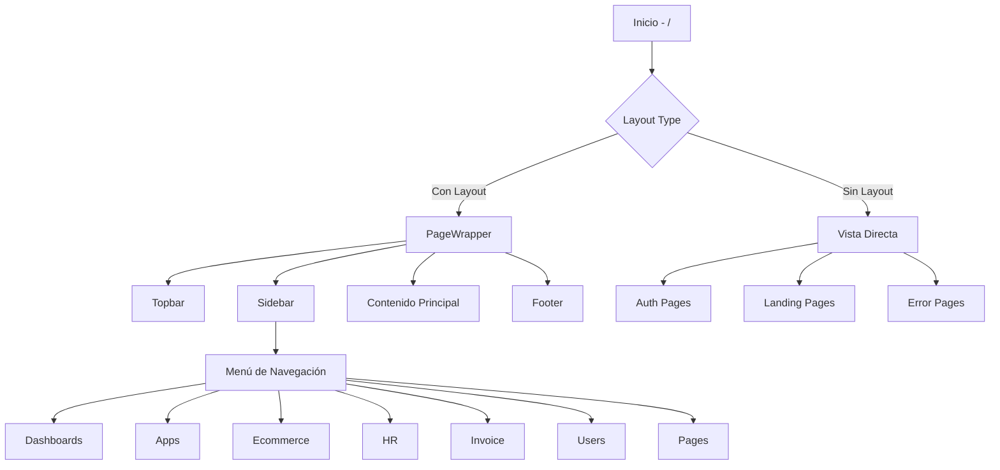

# Resumen Completo del Proyecto React-TS (Tailwick)

## 📋 Descripción General

Este proyecto es una **plantilla de administración completa** construida con React 19, TypeScript y Vite. Se llama "Tailwick" y es un sistema de administración empresarial full-featured con más de 60 páginas pre-construidas que cubren múltiples dominios de negocio.

**Propósito:** Servir como plantilla base para aplicaciones de administración empresarial, dashboards, e-commerce, gestión de recursos humanos, facturación, y más.

---

## 🏗️ Arquitectura del Proyecto

### Stack Tecnológico

#### Core
- **React**: v19.1.0 (última versión estable)
- **TypeScript**: v5.8.3
- **Vite**: v7.1.7 (build tool ultra-rápido)
- **React Router**: v7.9.1 (navegación)

#### Estilos y UI
- **Tailwind CSS**: v4.1.13 (última versión v4)
- **Preline UI**: v3.2.3 (componentes UI pre-construidos)
- **@tailwindcss/forms**: v0.5.10
- **@tailwindcss/typography**: v0.5.16

#### Librerías Adicionales
- **Chart/Visualización**: react-apexcharts
- **Calendario**: FullCalendar v6.1.19
- **Iconos**: lucide-react, react-icons, @iconify/react
- **Date Picker**: flatpickr, react-flatpickr
- **Carrusel**: Swiper v12.0.1
- **Scrollbar**: simplebar-react
- **Utilidades**: usehooks-ts v3.1.1

#### Herramientas de Desarrollo
- **ESLint**: v9.36.0 con configuración para React y TypeScript
- **Prettier**: v3.6.2 (formateo de código)
- **PostCSS**: v8.5.6
- **TypeScript ESLint**: v8.44.0

---

## 📁 Estructura del Proyecto

```
React-TS/
├── public/                    # Archivos estáticos públicos
├── src/
│   ├── app/                   # Todas las páginas/vistas
│   │   ├── (admin)/          # Módulo de administración
│   │   │   ├── (app)/        # Aplicaciones empresariales
│   │   │   │   ├── (ecommerce)/  # Módulo E-commerce
│   │   │   │   ├── (hr)/         # Módulo Recursos Humanos
│   │   │   │   ├── (invoice)/    # Módulo Facturación
│   │   │   │   ├── (users)/      # Gestión de usuarios
│   │   │   │   ├── calendar/     # Calendario
│   │   │   │   ├── chat/         # Chat
│   │   │   │   ├── mailbox/      # Correo
│   │   │   │   └── notes/        # Notas
│   │   │   ├── (dashboards)/     # Dashboards variados
│   │   │   ├── (layouts)/        # Variantes de layout
│   │   │   └── (pages)/          # Páginas extras
│   │   ├── (auth)/           # Autenticación (4 estilos)
│   │   ├── (landing)/        # Páginas de aterrizaje
│   │   └── (others)/         # Páginas especiales (404, etc.)
│   ├── assets/               # Imágenes, CSS globales
│   ├── components/           # Componentes reutilizables
│   │   ├── layouts/          # Layouts (Header, Sidebar, Footer)
│   │   └── client-wrapper/   # Wrappers para librerías externas
│   ├── context/              # Context API (LayoutContext)
│   ├── helpers/              # Funciones auxiliares
│   ├── routes/               # Configuración de rutas
│   ├── types/                # Definiciones TypeScript
│   ├── utils/                # Utilidades generales
│   ├── App.tsx               # Componente raíz
│   └── main.tsx              # Punto de entrada
├── index.html                # HTML base
├── tailwind.config.ts        # Configuración Tailwind
├── tsconfig.json             # Configuración TypeScript
├── vite.config.ts            # Configuración Vite
└── package.json              # Dependencias y scripts
```

---

## 🎯 Vistas y Módulos

El proyecto está organizado en **4 categorías principales** de vistas:

### 1. Admin (Área de Administración) - [(admin)/](file:///Users/joshsaune/Proyectos/React-TS/src/App.tsx#7-14)

#### A) Dashboards - 4 variantes
| Vista | Ruta | Propósito |
|-------|------|-----------|
| Analytics | `/analytics` | Dashboard con métricas y análisis |
| Ecommerce | `/` o `/index` | Dashboard principal e-commerce |
| Email | `/email` | Dashboard de gestión de correos |
| HR | `/hr` | Dashboard de recursos humanos |

#### B) Ecommerce - 9 páginas
| Vista | Ruta | Propósito |
|-------|------|-----------|
| Product List | [/product-list](file:///Users/joshsaune/Proyectos/React-TS/src/app/%28admin%29/%28app%29/%28ecommerce%29/product-list) | Lista de productos |
| Product Grid | [/product-grid](file:///Users/joshsaune/Proyectos/React-TS/src/app/%28admin%29/%28app%29/%28ecommerce%29/product-grid) | Vista en cuadrícula de productos |
| Product Details | [/product-overview](file:///Users/joshsaune/Proyectos/React-TS/src/app/%28admin%29/%28app%29/%28ecommerce%29/product-overview) | Detalles de un producto |
| Shopping Cart | [/cart](file:///Users/joshsaune/Proyectos/React-TS/src/app/%28admin%29/%28app%29/%28ecommerce%29/cart) | Carrito de compras |
| Checkout | [/checkout](file:///Users/joshsaune/Proyectos/React-TS/src/app/%28admin%29/%28app%29/%28ecommerce%29/checkout) | Proceso de pago |
| Add Products | [/product-create](file:///Users/joshsaune/Proyectos/React-TS/src/app/%28admin%29/%28app%29/%28ecommerce%29/product-create) | Crear/editar productos |
| Orders | [/orders](file:///Users/joshsaune/Proyectos/React-TS/src/app/%28admin%29/%28app%29/%28ecommerce%29/orders) | Lista de órdenes |
| Order Details | [/order-overview](file:///Users/joshsaune/Proyectos/React-TS/src/app/%28admin%29/%28app%29/%28ecommerce%29/order-overview) | Detalles de una orden |
| Sellers | [/sellers](file:///Users/joshsaune/Proyectos/React-TS/src/app/%28admin%29/%28app%29/%28ecommerce%29/sellers) | Gestión de vendedores |

#### C) HR Management - 15 páginas
| Vista | Ruta | Propósito |
|-------|------|-----------|
| Employee List | [/employee](file:///Users/joshsaune/Proyectos/React-TS/src/app/%28admin%29/%28app%29/%28hr%29/employee) | Lista de empleados |
| Holidays | [/holidays](file:///Users/joshsaune/Proyectos/React-TS/src/app/%28admin%29/%28app%29/%28hr%29/holidays) | Gestión de días festivos |
| Attendance (HR) | [/attendance](file:///Users/joshsaune/Proyectos/React-TS/src/app/%28admin%29/%28app%29/%28hr%29/attendance) | Control de asistencia (vista HR) |
| Main Attendance | [/attendance-main](file:///Users/joshsaune/Proyectos/React-TS/src/app/%28admin%29/%28app%29/%28hr%29/attendance-main) | Control principal de asistencia |
| Department | [/department](file:///Users/joshsaune/Proyectos/React-TS/src/app/%28admin%29/%28app%29/%28hr%29/department) | Gestión de departamentos |
| **Leave Management** | | |
| - By Employee | [/leave-employee](file:///Users/joshsaune/Proyectos/React-TS/src/app/%28admin%29/%28app%29/%28hr%29/leave-employee) | Permisos por empleado |
| - Add Leave (Employee) | [/create-leave-employee](file:///Users/joshsaune/Proyectos/React-TS/src/app/%28admin%29/%28app%29/%28hr%29/create-leave-employee) | Crear permiso (empleado) |
| - By HR | [/leave](file:///Users/joshsaune/Proyectos/React-TS/src/app/%28admin%29/%28app%29/%28hr%29/leave) | Permisos gestión HR |
| - Add Leave (HR) | [/create-leave](file:///Users/joshsaune/Proyectos/React-TS/src/app/%28admin%29/%28app%29/%28hr%29/create-leave) | Crear permiso (HR) |
| **Sales** | | |
| - Estimates | [/sales-estimates](file:///Users/joshsaune/Proyectos/React-TS/src/app/%28admin%29/%28app%29/%28hr%29/sales-estimates) | Estimaciones de ventas |
| - Payments | [/sales-payments](file:///Users/joshsaune/Proyectos/React-TS/src/app/%28admin%29/%28app%29/%28hr%29/sales-payments) | Pagos |
| - Expenses | [/sales-expenses](file:///Users/joshsaune/Proyectos/React-TS/src/app/%28admin%29/%28app%29/%28hr%29/sales-expenses) | Gastos |
| **Payroll** | | |
| - Employee Salary | [/payroll-employee-salary](file:///Users/joshsaune/Proyectos/React-TS/src/app/%28admin%29/%28app%29/%28hr%29/payroll-employee-salary) | Salarios |
| - Payslip | [/payroll-payslip](file:///Users/joshsaune/Proyectos/React-TS/src/app/%28admin%29/%28app%29/%28hr%29/payroll-payslip) | Nóminas |
| - Create Payslip | [/create-payslip](file:///Users/joshsaune/Proyectos/React-TS/src/app/%28admin%29/%28app%29/%28hr%29/create-payslip) | Crear nómina |

#### D) Invoice - 3 páginas
| Vista | Ruta | Propósito |
|-------|------|-----------|
| Overview | `/overview` | Resumen de facturas |
| List Invoice | `/list` | Lista de facturas |
| Add Invoice | `/add-new` | Crear factura |

#### E) Users - 2 páginas
| Vista | Ruta | Propósito |
|-------|------|-----------|
| List View | `/users-list` | Usuarios en lista |
| Grid View | `/users-grid` | Usuarios en cuadrícula |

#### F) Apps - 4 aplicaciones
| Vista | Ruta | Propósito |
|-------|------|-----------|
| Chat | `/chat` | Mensajería interna |
| Calendar | `/calendar` | Calendario con eventos |
| Email | `/mailbox` | Cliente de correo |
| Notes | `/notes` | Toma de notas |

#### G) Layouts - 9 variantes
Diferentes configuraciones de layout para demostrar flexibilidad:
- `/sidenav-hover` - Sidebar con hover
- `/sidenav-hover-active` - Sidebar hover activo
- `/sidenav-small` - Sidebar pequeño
- `/sidenav-compact` - Sidebar compacto
- `/sidenav-offcanvas` - Sidebar offcanvas
- `/sidenav-hidden` - Sin sidebar
- `/sidenav-dark` - Sidebar oscuro
- `/dark-mode` - Modo oscuro completo
- `/rtl-mode` - Modo RTL (right-to-left)

#### H) Pages Extras - 6 páginas
| Vista | Ruta | Propósito |
|-------|------|-----------|
| Starter Page | `/starter` | Página inicial limpia |
| Pricing | `/pricing` | Planes de precios |
| FAQ | `/faqs` | Preguntas frecuentes |
| Timeline | `/timeline` | Línea de tiempo |

---

### 2. Auth (Autenticación) - [(auth)/](file:///Users/joshsaune/Proyectos/React-TS/src/App.tsx#7-14)

**4 estilos de diseño** × 7 funcionalidades = **28 páginas**

#### Estilos de Diseño:
1. **Basic** - Diseño simple y minimalista
2. **Boxed** - Con contenedor centrado tipo caja
3. **Cover** - Con imagen de fondo grande
4. **Modern** - Diseño moderno y elegante

#### Funcionalidades por Estilo:
- Login
- Register
- Verify Email
- Two-Step Verification
- Logout
- Reset Password
- Create Password

**Ejemplos de rutas:**
- [/basic-login](file:///Users/joshsaune/Proyectos/React-TS/src/app/%28auth%29/basic-login), [/boxed-login](file:///Users/joshsaune/Proyectos/React-TS/src/app/%28auth%29/boxed-login), [/cover-login](file:///Users/joshsaune/Proyectos/React-TS/src/app/%28auth%29/cover-login), [/modern-login](file:///Users/joshsaune/Proyectos/React-TS/src/app/%28auth%29/modern-login)
- [/basic-register](file:///Users/joshsaune/Proyectos/React-TS/src/app/%28auth%29/basic-register), [/boxed-register](file:///Users/joshsaune/Proyectos/React-TS/src/app/%28auth%29/boxed-register), etc.

---

### 3. Landing (Páginas de Aterrizaje) - [(landing)/](file:///Users/joshsaune/Proyectos/React-TS/src/App.tsx#7-14)

| Vista | Ruta | Propósito |
|-------|------|-----------|
| One Page Landing | [/onepage-landing](file:///Users/joshsaune/Proyectos/React-TS/src/app/%28landing%29/onepage-landing) | Landing page de una sola página |
| Product Landing | [/product-landing](file:///Users/joshsaune/Proyectos/React-TS/src/app/%28landing%29/product-landing) | Landing page de producto |

---

### 4. Others (Páginas Especiales) - [(others)/](file:///Users/joshsaune/Proyectos/React-TS/src/App.tsx#7-14)

| Vista | Ruta | Propósito |
|-------|------|-----------|
| 404 Error | `/404` | Página no encontrada |
| Coming Soon | `/coming-soon` | Próximamente |
| Maintenance | `/maintenance` | Mantenimiento |
| Offline | `/offline` | Sin conexión |

---

## 🔄 Flujo de Datos y Arquitectura de Componentes

### Sistema de Routing

El proyecto usa **React Router v7** con una arquitectura de rutas organizada:

```typescript
// src/routes/index.tsx
<Routes>
  {layoutsRoutes.map(route => (
    <Route 
      path={route.path} 
      element={<PageWrapper>{route.element}</PageWrapper>} 
    />
  ))}
  
  {singlePageRoutes.map(route => (
    <Route path={route.path} element={route.element} />
  ))}
</Routes>
```

**Dos tipos de rutas:**
1. **layoutsRoutes**: Páginas con layout completo (sidebar, header, footer)
2. **singlePageRoutes**: Páginas standalone (auth, landing, error pages)

### Lazy Loading

**TODAS las vistas** usan lazy loading para optimización:

```typescript
const Cart = lazy(() => import('@/app/(admin)/(app)/(ecommerce)/cart'));
const Login = lazy(() => import('@/app/(auth)/basic-login'));
// ... etc
```

**Beneficio:** Carga inicial rápida, solo descarga código cuando se necesita.

### Sistema de Layout

#### PageWrapper
Envuelve todas las páginas con layout estándar:
- Header/Topbar
- Sidebar/Navegación
- Breadcrumbs
- Footer

```typescript
// Cada página admin usa:
<PageWrapper>
  <PageView />
</PageWrapper>
```

#### Componentes de Layout
```
components/layouts/
├── topbar/              # Barra superior
│   ├── index.tsx       # Topbar principal
│   ├── SidenavToggle   # Toggle del sidebar
│   └── ThemeModeToggle # Cambio de tema
├── SideNav/             # Navegación lateral
│   ├── index.tsx       # Sidebar principal
│   ├── AppMenu.tsx     # Menú de navegación
│   ├── menu.ts         # Definición del menú
│   └── HoverToggle.tsx # Funcionalidad hover
├── customizer/          # Personalizador de UI
│   ├── ThemeMode       # Selector de tema
│   ├── Direction       # LTR/RTL
│   ├── SidenavView     # Tamaños de sidebar
│   ├── SidenavColor    # Color del sidebar
│   └── FullScreenToggle
└── Footer.tsx           # Pie de página
```

---

## 🎨 Gestión de Estado

### Context API - LayoutContext

El proyecto usa **React Context** para gestión de estado global del layout:

```typescript
// src/context/useLayoutContext.tsx

// Estado persistido en localStorage
type LayoutStateType = {
  sidenav: {
    size: 'default' | 'hover' | 'hover-active' | 'sm' | 'md' | 'offcanvas' | 'hidden';
    color: 'light' | 'dark';
  };
  theme: 'light' | 'dark' | 'system';
  dir: 'ltr' | 'rtl';
};
```

**Funciones del Context:**
- `updateSettings()` - Actualiza configuración del layout
- `reset()` - Resetea a valores por defecto
- Persistencia automática en `localStorage` con key `__TAILWICK_NEXT_CONFIG__`
- Sincronización automática de `data-*` attributes en el DOM

**Características avanzadas:**
- Detección automática del tema del sistema
- Responsive: ajusta sidebar según tamaño de pantalla
  - ≤768px: modo offcanvas
  - ≤1140px: sidebar pequeño
  - >1140px: modo por defecto
- Debounce en resize eventos (200ms)
- MutationObserver para detectar cambios dinámicos

### Hooks Personalizados

- [useLayoutContext()](file:///Users/joshsaune/Proyectos/React-TS/src/context/useLayoutContext.tsx#55-62) - Acceso al contexto de layout
- `useLocalStorage()` (de usehooks-ts) - Persistencia
- Hooks de react-router: `useLocation()`, `useNavigate()`

### Preline UI - Auto-inicialización

```typescript
// ProvidersWrapper maneja la inicialización de Preline
useEffect(() => {
  import('preline/preline').then(() => {
    window.HSStaticMethods.autoInit();
  });
}, []);

// Re-inicializa en cada cambio de ruta
useEffect(() => {
  window.HSStaticMethods.autoInit();
}, [path]);
```

---

## 🎨 Sistema de Estilos

### Tailwind CSS v4

Configuración personalizada con:

```typescript
// tailwind.config.ts
plugins: [
  '@tailwindcss/forms',      // Estilos para formularios
  '@tailwindcss/typography', // Estilos tipográficos
  'preline/plugin',          // Componentes Preline
]

colors: {
  primary: '#3b82f6',       // Azul primario
  'default-500': '#6b7280', // Gris neutral
  'default-800': '#1f2937', // Gris oscuro
  'default-200': '#e5e7eb', // Gris claro
}
```

### CSS Global

```css
/* src/assets/css/style.css */
@import 'flatpickr/dist/flatpickr.css';
@import 'swiper/swiper-bundle.css';
@tailwind base;
@tailwind components;
@tailwind utilities;
```

### Path Aliases

TypeScript configurado con alias `@/` para imports limpios:

```typescript
// tsconfig.app.json
"paths": {
  "@/*": ["./src/*"]
}

// Permite:
import PageMeta from '@/components/PageMeta';
// En lugar de:
import PageMeta from '../../../components/PageMeta';
```

---

## 📊 Patrón de Componentes

### Estructura típica de una página

```typescript
// Ejemplo: Dashboard Ecommerce
const EcommerceDashboard = () => {
  return (
    <>
      <PageMeta title="Ecommerce" />
      <main>
        <PageBreadcrumb title="Ecommerce" subtitle="Dashboards" />
        
        {/* Grid layout con Tailwind */}
        <div className="grid lg:grid-cols-3 grid-cols-1 gap-5">
          <WelcomeUser />
          <OrderStatistics />
        </div>
        
        <ProductOrders />
        
        <div className="grid lg:grid-cols-4 gap-5">
          <CustomerService />
          <SalesThisMonth />
          <TopSellingProducts />
          <Audience />
        </div>
      </main>
    </>
  );
};
```

### Componentes Reutilizables

Cada página se compone de componentes pequeños ubicados en:
```
src/app/(admin)/(dashboards)/index/
├── index.tsx              # Página principal
└── components/            # Componentes específicos
    ├── WelcomeUser.tsx
    ├── OrderStatistics.tsx
    ├── SalesThisMonth.tsx
    └── ...
```

**No hay estado compartido complejo** - Los componentes son mayormente presentacionales con datos mock/estáticos.

---

## 🧩 Componentes Wrapper Cliente

Para librerías que requieren ejecución en el cliente:

```
components/client-wrapper/
├── ApexChartClient.tsx    # Wrapper para react-apexcharts
├── IconifyIcon.tsx        # Wrapper para @iconify/react
└── SimplebarClient.tsx    # Wrapper para simplebar-react
```

Estos wrappers manejan la inicialización correcta de librerías externas.

---

## 🔧 Configuración de Build

### Vite Config

```typescript
// vite.config.ts
export default defineConfig({
  plugins: [react()],
  resolve: {
    alias: {
      '@': path.resolve(__dirname, './src'),
    },
  },
});
```

### TypeScript Config

- **Modo estricto activado** (`strict: true`)
- **noUnusedLocals** y **noUnusedParameters**: true
- **Target**: ES2022
- **JSX**: react-jsx (nueva transformación JSX)
- **Module Resolution**: bundler (optimizado para Vite)

---

## 📦 Scripts Disponibles

```json
{
  "dev": "vite",                        // Servidor de desarrollo
  "build": "tsc -b && vite build",      // Build de producción
  "lint": "eslint .",                   // Linting
  "preview": "vite preview",            // Preview del build
  "format": "prettier --write .",       // Formatear código
  "format:check": "prettier --check ."  // Verificar formato
}
```

---

## 🎯 Características Clave del Proyecto

### ✅ Ventajas

1. **Moderno**: React 19, TypeScript 5.8, Tailwind v4
2. **Optimizado**: Lazy loading en todas las rutas
3. **Completo**: 60+ páginas listas para usar
4. **Flexible**: 9 variantes de layout configurables
5. **Responsive**: Adaptable a todos los dispositivos
6. **Accesible**: Uso de Preline UI con componentes accesibles
7. **Type-safe**: TypeScript en modo estricto
8. **Rápido**: Vite para desarrollo ultra-rápido
9. **Persistente**: Layout preferences en localStorage
10. **Profesional**: ESLint + Prettier configurados

### 🎨 Estilo de Código

- **Componentes funcionales** (no class components)
- **Hooks modernos** (incluye React 19's [use()](file:///Users/joshsaune/Proyectos/React-TS/src/context/useLayoutContext.tsx#55-62))
- **Typed props** con TypeScript
- **Tailwind utility-first** (no CSS modules)
- **Imports organizados** con path aliases

---

## 📚 Caso de Uso

Este proyecto es ideal como **plantilla base** para:

1. **Sistemas ERP/CRM empresariales**
2. **Plataformas e-commerce con panel admin**
3. **Aplicaciones de gestión de recursos humanos**
4. **Dashboards analíticos**
5. **Plataformas SaaS multi-tenant**
6. **Sistemas de gestión de proyectos**

**No es ideal para**: Aplicaciones que requieren server-side rendering (SSR) o generación estática (SSG) - para eso se recomendaría Next.js o Remix.

---

## 🔄 Flujo de Navegación



---

## 📱 Responsive Design

El proyecto está optimizado para 3 breakpoints principales:

- **Mobile**: ≤768px (sidebar como offcanvas)
- **Tablet**: 769px - 1140px (sidebar compacto)
- **Desktop**: >1140px (sidebar completo)

Tailwind breakpoints utilizados:
- `sm:` - 640px
- `md:` - 768px
- `lg:` - 1024px
- `xl:` - 1280px
- `2xl:` - 1536px

---

## 🔌 Integración con APIs

**Nota importante:** El proyecto actual usa **datos mock/estáticos**. No hay integración con backend.

Para integrar con APIs:
1. Crear carpeta `src/services/` para llamadas API
2. Usar `fetch` o `axios` para peticiones HTTP
3. Implementar Context o estado global (Redux, Zustand) para datos
4. Agregar React Query/SWR para cache y sincronización

---

## 🌐 Internacionalización (i18n)

**Actualmente NO implementado**, pero preparado para agregar:
- react-i18next
- Soporte RTL ya incluido en layoutContext

---

## 🔐 Autenticación

Las **28 páginas de auth son solo UI**, no hay lógica de autenticación real.

Para implementar autenticación:
1. Elegir proveedor: Firebase, Auth0, Supabase, o custom
2. Crear `AuthContext` para gestionar estado de usuario
3. Implementar ProtectedRoute wrapper
4. Agregar token management y refresh flow

---

## 📈 Resumen de Números

| Concepto | Cantidad |
|----------|----------|
| **Total de páginas/vistas** | **60+** |
| Dashboards | 4 |
| Ecommerce | 9 |
| HR Management | 15 |
| Invoice | 3 |
| Users | 2 |
| Apps | 4 |
| Auth | 28 (4 estilos × 7 tipos) |
| Landing | 2 |
| Layout variants | 9 |
| Pages extras | 6 |
| Error/Special | 4 |
| **Dependencias totales** | **40** |
| **DevDependencies** | **14** |
| **Líneas de configuración routing** | **230** |

---

Esta plantilla es extremadamente completa y está lista para servir como base sólida para cualquier proyecto de administración empresarial moderno. 🚀
